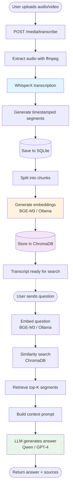

# MeetMind

**RAG-based Meeting Transcript Search API** — AI-powered semantic search and transcription for your meeting recordings.

---

## 📑 Table of Contents

- [MeetMind](#meetmind)
  - [📑 Table of Contents](#-table-of-contents)
  - [📖 Description](#-description)
  - [🛠️ Technology Stack](#️-technology-stack)
  - [📁 Project Structure](#-project-structure)
  - [🔄 Workflow Architecture](#-workflow-architecture)
  - [🚀 Quick Start](#-quick-start)
    - [Prerequisites](#prerequisites)
      - [Hardware Requirements](#hardware-requirements)
    - [Linux/macOS](#linuxmacos)
    - [Windows](#windows)
    - [Verify Installation](#verify-installation)
  - [📚 API Endpoints](#-api-endpoints)
    - [Health Check](#health-check)
    - [Upload Transcript (Plain Text)](#upload-transcript-plain-text)
    - [List Transcripts](#list-transcripts)
    - [Transcribe Audio/Video](#transcribe-audiovideo)
    - [Semantic Search](#semantic-search)
    - [Search Statistics](#search-statistics)
  - [⚙️ Configuration](#️-configuration)
    - [Provider Configuration](#provider-configuration)
    - [WhisperX Configuration](#whisperx-configuration)
      - [Model Selection Guide](#model-selection-guide)
      - [Example Configurations](#example-configurations)
    - [Search Configuration](#search-configuration)
  - [🔧 Swagger UI](#-swagger-ui)

---

## 📖 Description

**MeetMind** is a production-ready FastAPI backend that combines:

1. **Audio Transcription** — Automatic speech-to-text conversion using [WhisperX](https://github.com/m-bain/whisperX) with speaker diarization and word-level timestamps.
2. **RAG (Retrieval-Augmented Generation)** — Semantic search over meeting transcripts using embeddings (BGE-M3) and vector database (ChromaDB).
3. **LLM-powered Q&A** — Natural language queries answered by local LLM (Qwen 2.5/3.0 via Ollama) or cloud providers (OpenAI, HuggingFace).

**Use Cases:**
- Search across hundreds of meeting recordings by keyword or semantic meaning
- Ask questions like *"What did we decide about the Q3 roadmap?"* and get context-aware answers
- Automatically transcribe audio/video files with high accuracy (large-v3 model)
- Filter search results by date range, speaker, or meeting topic

**Key Features:**
- Docker-based deployment with persistent volumes
- Multi-provider support: local (Ollama + HuggingFace), OpenAI, HuggingFace Inference API
- Async SQLAlchemy + aiosqlite for high-throughput database operations
- Health checks and automatic database migrations (Alembic-ready)

---

## 🛠️ Technology Stack

| Category | Technology | Purpose |
|----------|-----------|---------|
| **Backend** | FastAPI 0.109+ | High-performance async web framework |
| | Python 3.11 | Runtime environment |
| | Uvicorn | ASGI server |
| **Database** | SQLite + aiosqlite | Async relational database for metadata |
| | SQLAlchemy 2.0 | ORM with async support |
| | ChromaDB 0.4+ | Vector database for embeddings |
| **AI/ML** | WhisperX 3.1+ | Audio transcription with diarization |
| | LangChain 0.1+ | RAG pipeline orchestration |
| | Ollama | Local LLM inference (Qwen 2.5/3.0) |
| | HuggingFace | Embedding models (BGE-M3) |
| | PyTorch 2.0+ | Deep learning framework |
| **DevOps** | Docker + Docker Compose | Containerization |
| | ffmpeg | Audio/video processing |
| | curl | Health checks |

---

## 📁 Project Structure

```
meetmind/
├── app/
│   ├── main.py              # FastAPI app initialization, lifespan, CORS
│   ├── config.py            # Pydantic settings (env vars, providers)
│   │
│   ├── api/                 # REST API endpoints
│   │   ├── transcripts.py   # POST /transcripts (upload), GET /transcripts (list)
│   │   ├── search.py        # POST /search (RAG query), GET /search/stats
│   │   └── media.py         # POST /media/transcribe (audio → text)
│   │
│   ├── db/                  # Database layer
│   │   ├── database.py      # Async SQLite engine, session factory, init_db()
│   │   └── models.py        # SQLAlchemy models (Transcript, Segment)
│   │
│   └── services/            # Business logic
│       ├── embeddings/      # Embedding providers (base, local, openai, huggingface)
│       ├── llm/             # LLM providers (base, local/Ollama, openai, huggingface)
│       ├── rag.py           # RAG pipeline: embed query → retrieve context → LLM answer
│       └── transcription.py # WhisperX wrapper: audio → segments with timestamps
│
├── data/                    # Persistent volume: SQLite database (meetmind.db)
├── chroma_db/               # Persistent volume: ChromaDB vector storage
├── media_uploads/           # Persistent volume: Temporary audio files
│
├── Dockerfile               # Python 3.11-slim + ffmpeg + requirements.txt
├── docker-compose.yml       # Service definition with volumes, healthcheck
├── entrypoint-web.sh        # Startup script: alembic migrations → uvicorn
│
├── .env.example             # Environment template
├── requirements.txt         # Python dependencies
├── README.md                # This file
├── DOCKER.md                # Docker deployment guide
└── MODEL_COMPARISON.md      # LLM/embedding model benchmarks
```

**Module Descriptions:**

- **`api/transcripts.py`** — Upload plain-text transcripts, retrieve transcript history
- **`api/search.py`** — Semantic search endpoint, returns LLM-generated answers with source segments
- **`api/media.py`** — Upload audio/video, transcribe with WhisperX, store segments in database
- **`services/rag.py`** — Core RAG logic: embeds question, retrieves top-K similar segments from ChromaDB, generates answer via LLM
- **`services/transcription.py`** — WhisperX integration: loads model, transcribes audio, returns timestamped segments
- **`db/models.py`** — `Transcript` (id, filename, upload_date), `Segment` (transcript_id, text, start_time, end_time, speaker)

---

## 🔄 Workflow Architecture



**Key Steps:**

1. **Upload** → User uploads audio/video file (MP3, WAV, MP4, etc.)
2. **Transcription** → WhisperX converts speech to text with speaker labels and timestamps
3. **Storage** → Segments saved to SQLite (metadata) and ChromaDB (embeddings)
4. **Search** → User asks question in natural language
5. **Retrieval** → Question embedded, similar segments retrieved via cosine similarity
6. **Generation** → LLM synthesizes answer from retrieved context
7. **Response** → User receives answer with source references (transcript, timestamp)

---

## 🚀 Quick Start

### Prerequisites

- **Docker** and **Docker Compose** installed
- **Ollama** running locally (for `local` provider) — [Install Ollama](https://ollama.ai/)
- (Optional) **NVIDIA GPU** with CUDA 11.8+ for accelerated transcription

#### Hardware Requirements

**For GPU-accelerated transcription (recommended):**
- NVIDIA GPU with CUDA 11.8+ support
- Minimum 10 GB VRAM (for large-v3 model)
- 16 GB+ RAM
- Performance: ~7-20 seconds per minute of audio (depending on GPU)

**For CPU-only mode:**
- **Minimum:** 8 GB RAM, 4-core CPU, use `base` or `small` model
- **Recommended:** 16 GB RAM, 8+ cores (Intel i7/AMD Ryzen 7+), use `medium` model
- **Performance:** 5-10x realtime for small models, 100-120x realtime for large models (not recommended)

**Note:** GPU transcription is **20-100x faster** than CPU. For production use with large-v3 model, GPU is strongly recommended.

### Linux/macOS

```bash
# 1. Clone repository
git clone https://github.com/IvanGorbunov/meetmind.git
cd meetmind

# 2. Copy environment template
cp .env.example .env

# 3. Configure settings (optional)
nano .env
# Set OLLAMA_MODEL (e.g., qwen2.5-coder:7b)
# Set EXTERNAL_PORT if 8000 is in use

# 4. Pull Ollama model (if using local provider)
ollama pull qwen2.5-coder:7b

# 5. Start services
docker-compose up -d

# 6. View logs
docker-compose logs -f web
```

### Windows

```powershell
# 1. Clone repository
git clone https://github.com/IvanGorbunov/meetmind.git
cd meetmind

# 2. Copy environment template
copy .env.example .env

# 3. Configure settings (optional)
notepad .env
# Set OLLAMA_MODEL (e.g., qwen2.5-coder:7b)
# Set EXTERNAL_PORT if 8000 is in use

# 4. Pull Ollama model (if using local provider)
ollama pull qwen2.5-coder:7b

# 5. Start services
docker-compose up -d

# 6. View logs
docker-compose logs -f web
```

### Verify Installation

```bash
# Check health status
curl http://localhost:8000/health

# Expected response:
# {"status":"healthy"}

# Check API info
curl http://localhost:8000/

# Expected response:
# {
#   "status": "ok",
#   "service": "MeetMind",
#   "version": "1.0.0",
#   "providers": {
#     "embeddings": "local",
#     "llm": "local"
#   }
# }

# Open Swagger UI
# Navigate to: http://localhost:8000/docs
```

**Container Status:**

```bash
# Check if container is healthy
docker-compose ps

# Expected output:
# NAME    SERVICE  STATUS                   PORTS
# web     web      Up (healthy)            0.0.0.0:8000->8000/tcp
```

**Stop Services:**

```bash
docker-compose down
```

---

## 📚 API Endpoints

### Health Check

```bash
GET /
GET /health
```

**Example:**

```bash
curl http://localhost:8000/health
# Response: {"status":"healthy"}
```

### Upload Transcript (Plain Text)

```bash
POST /transcripts
```

**Example:**

```bash
curl -X POST "http://localhost:8000/transcripts" \
  -F "file=@meeting_notes.txt"
```

**Response:**

```json
{
  "id": 1,
  "filename": "meeting_notes.txt",
  "upload_date": "2026-01-28T10:30:00",
  "segments_count": 42
}
```

### List Transcripts

```bash
GET /transcripts
```

**Example:**

```bash
curl http://localhost:8000/transcripts
```

**Response:**

```json
[
  {
    "id": 1,
    "filename": "meeting_notes.txt",
    "upload_date": "2026-01-28T10:30:00",
    "segments_count": 42
  }
]
```

### Transcribe Audio/Video

```bash
POST /media/transcribe
```

**Example:**

```bash
curl -X POST "http://localhost:8000/media/transcribe" \
  -F "file=@meeting.mp3" \
  -F "language=ru"
```

**Response:**

```json
{
  "transcript_id": 2,
  "filename": "meeting.mp3",
  "segments": [
    {
      "text": "Добрый день, коллеги.",
      "start": 0.5,
      "end": 2.3,
      "speaker": "SPEAKER_00"
    }
  ],
  "duration": 1823.4
}
```

### Semantic Search

```bash
POST /search
```

**Example:**

```bash
curl -X POST "http://localhost:8000/search" \
  -H "Content-Type: application/json" \
  -d '{
    "question": "Когда обсуждали дедлайн проекта?",
    "date_from": "2026-01-01",
    "date_to": "2026-01-31"
  }'
```

**Response:**

```json
{
  "answer": "Дедлайн проекта обсуждали 15 января. Команда согласовала финальную дату сдачи — 28 февраля.",
  "sources": [
    {
      "transcript_id": 2,
      "filename": "meeting.mp3",
      "text": "Давайте зафиксируем дедлайн. Предлагаю 28 февраля.",
      "start": 542.1,
      "end": 548.3,
      "speaker": "SPEAKER_01"
    }
  ]
}
```

**Note:** If `date_from`/`date_to` are not provided, search defaults to the last 7 days.

### Search Statistics

```bash
GET /search/stats
```

**Example:**

```bash
curl http://localhost:8000/search/stats
```

**Response:**

```json
{
  "total_transcripts": 5,
  "total_segments": 347,
  "date_range": {
    "earliest": "2026-01-10",
    "latest": "2026-01-28"
  }
}
```

---

## ⚙️ Configuration

### Provider Configuration

Edit `.env` to select embedding and LLM providers:

| Variable | Values | Description |
|----------|--------|-------------|
| `EMBEDDINGS_PROVIDER` | `local`, `openai`, `huggingface` | Embeddings provider |
| `LLM_PROVIDER` | `local`, `openai`, `huggingface` | LLM provider |

**Provider Modes:**

| Mode | Embeddings | LLM | Requirements |
|------|------------|-----|--------------|
| **local** (recommended) | HuggingFace BGE-M3 | Ollama (Qwen 2.5/3.0) | GPU 8GB+, Ollama installed |
| **openai** | OpenAI API | GPT-4 | OpenAI API key |
| **huggingface** | HF Inference API | HF Inference API | HuggingFace token |

**Example `.env` (local mode):**

```bash
EMBEDDINGS_PROVIDER=local
LLM_PROVIDER=local
LOCAL_EMBEDDING_MODEL=BAAI/bge-m3
OLLAMA_MODEL=qwen2.5-coder:7b
OLLAMA_BASE_URL=http://localhost:11434
```

**Example `.env` (OpenAI mode):**

```bash
EMBEDDINGS_PROVIDER=openai
LLM_PROVIDER=openai
OPENAI_API_KEY=sk-your-openai-key-here
```

### WhisperX Configuration

| Variable | Default | Options | Description |
|----------|---------|---------|-------------|
| `WHISPERX_MODEL` | `large-v3` | `tiny`, `base`, `small`, `medium`, `large-v2`, `large-v3` | Model size (larger = more accurate, slower) |
| `WHISPERX_DEVICE` | `cuda` | `cuda`, `cpu` | Device for inference (GPU recommended) |
| `WHISPERX_COMPUTE_TYPE` | `float16` | `float16`, `int8` (GPU), `float32` (CPU) | Precision level |

#### Model Selection Guide

| Model | Size | Accuracy | Speed (GPU) | Speed (CPU) | RAM | VRAM | Use Case |
|-------|------|----------|-------------|-------------|-----|------|----------|
| `tiny` | 39 MB | ⭐⭐ | ⚡⚡⚡ | ⚡⚡ | 1 GB | 1 GB | Quick drafts, low resources |
| `base` | 74 MB | ⭐⭐⭐ | ⚡⚡⚡ | ⚡ | 1.5 GB | 1 GB | Development, testing |
| `small` | 244 MB | ⭐⭐⭐⭐ | ⚡⚡⚡ | ⚡ | 2 GB | 2 GB | CPU production (acceptable quality) |
| `medium` | 769 MB | ⭐⭐⭐⭐ | ⚡⚡ | 🐌 | 5 GB | 5 GB | Balanced GPU usage |
| `large-v2` | 1550 MB | ⭐⭐⭐⭐⭐ | ⚡ | 🐌🐌 | 10 GB | 10 GB | High accuracy (legacy) |
| `large-v3` | 1550 MB | ⭐⭐⭐⭐⭐ | ⚡ | 🐌🐌 | 10 GB | 10 GB | Best accuracy (recommended for GPU) |

**Performance Estimates:**
- **GPU (RTX 4090):** large-v3 ≈ 7 sec/min audio (0.12x realtime)
- **GPU (RTX 4060ti):** large-v3 ≈ 18 sec/min audio (0.3x realtime)
- **CPU (16-core):** base ≈ 5-10x realtime, small ≈ 10-20x realtime
- **CPU (16-core):** large-v3 ≈ 100-120x realtime (**not recommended**)

#### Example Configurations

**GPU Production (recommended):**

```bash
WHISPERX_MODEL=large-v3
WHISPERX_DEVICE=cuda
WHISPERX_COMPUTE_TYPE=float16
```

**CPU with Acceptable Quality:**

```bash
WHISPERX_MODEL=small
WHISPERX_DEVICE=cpu
WHISPERX_COMPUTE_TYPE=float32
```

**CPU Budget/Testing:**

```bash
WHISPERX_MODEL=base
WHISPERX_DEVICE=cpu
WHISPERX_COMPUTE_TYPE=float32
```

**Note:** 
- GPU transcription is **20-100x faster** than CPU
- For production with large-v3, GPU is **strongly recommended**
- CPU mode suitable only for small models (base/small) or non-realtime use cases

### Search Configuration

| Variable | Default | Description |
|----------|---------|-------------|
| `RAG_TOP_K` | `5` | Number of similar segments to retrieve |
| `RAG_PROMPT_TEMPLATE` | (see `.env.example`) | Prompt template with `{context}` and `{question}` placeholders |


---

## 🔧 Swagger UI

Interactive API documentation is available at:

**http://localhost:8000/docs**

Features:
- Try all endpoints directly from the browser
- Upload files via Swagger UI
- View request/response schemas
- Test semantic search with custom queries


